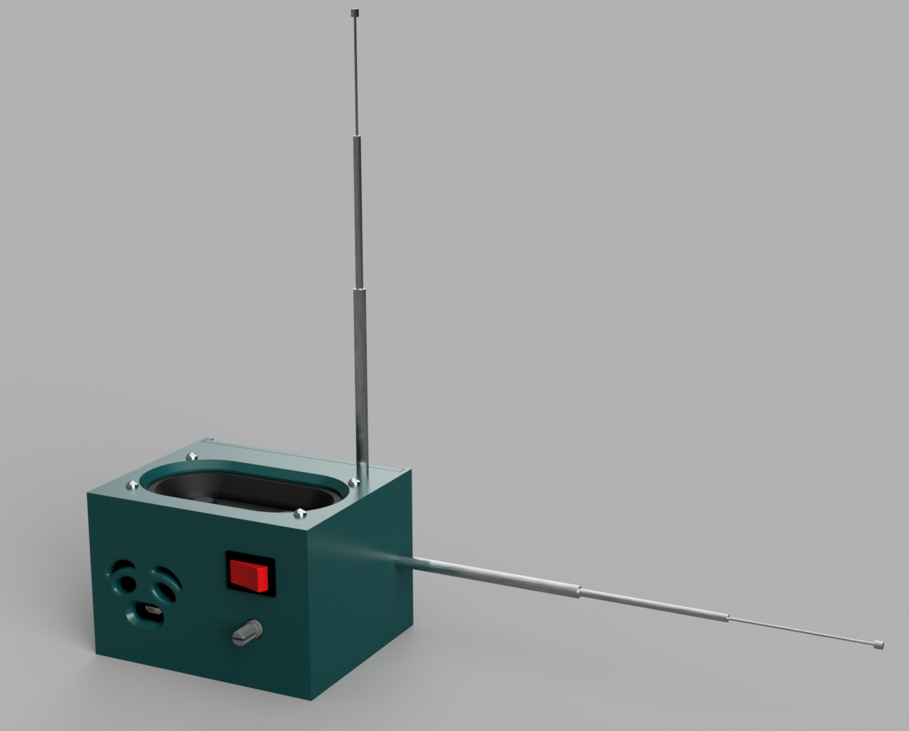

# Терменвокс
### *Шелонин Арсений, ФРКТ МФТИ Б01-411*

    

## 1 Архитектура системы

Проект представляет собой цифровую реализацию терменвокса на базе микроконтроллера ESP32 с возможностью передачи телеметрии на ПК для управления курсором мыши.

Система состоит из трех ключевых модулей:
1. **Прошивка ESP32 (C++)**: Обработка сигналов с емкостных антенн, цифровая генерация звука (DSP), фильтрация и передача данных по интерфейсам Serial и Bluetooth Low Energy (BLE).
2. **BLE-сервер (C++)**: Модуль приема конфигурационных параметров (калибровка, множитель громкости, переключение режимов).
3. **Скрипт управления ПК (Python)**: Чтение нормализованных координат из последовательного порта и трансляция их в векторы движения курсора ОС.

---

## 2 Математическая модель и цифровая обработка сигналов (DSP)

### 2.1 Получение и фильтрация данных с антенн

Антенны подключены к АЦП ESP32 (пины 32 и 33) с разрешением 12 бит (значения от 0 до 4095) и аттенюацией 11 дБ. В связи с высокой зашумленностью измерений емкости применяется экспоненциальное скользящее среднее (EMA — Exponential Moving Average) как фильтр низких частот (ФНЧ) первого порядка.

Разностное уравнение фильтра:
$$y[n]=y[n-1]\cdot(1-\alpha)+x[n]\cdot\alpha \qquad (1)$$

где $x[n]$ — текущее сырое значение АЦП, $y[n]$ — отфильтрованное значение, $\alpha=0.1$ — коэффициент сглаживания (`filter_coeff`).

Далее происходит нормализация отфильтрованного значения в диапазон $[0, 1]$ на основе калибровочных констант $C_{min}$ (`MIN_RAW_VALUE`) и $C_{max}$ (`MAX_RAW_VALUE`):
$$N[n]=\max(0,\min(1,\frac{y[n]-C_{min}}{C_{max}-C_{min}})) \qquad (2)$$

### 2.2 Формирование управляющих сигналов для звука

Полученные нормализованные значения антенн $N_{v}$ (громкость) и $N_{f}$ (частота) проходят дополнительную нелинейную обработку.

**1. Мертвая зона и степенная кривая громкости.**
Для исключения фонового шума при отсутствии рук в зоне антенны вводится мертвая зона $D=0.05$. Если $N_{v}>D$, вычисляется эффективное значение:
$$V_{adj}[n]=\max(0,\min(1,\frac{N_{v}[n]-D}{1-D})) \qquad (3)$$

Для соответствия логарифмическому восприятию громкости человеческим ухом применяется степенная функция с показателем $\gamma=0.4$ (`VOLUME_POWER_CURVE`):
$$V_{target}[n]=\min(V_{adj}[n]^{\gamma}\cdot 1.3, 1.0) \qquad (4)$$

**2. Линейная интерполяция частоты.**
Целевая частота $f_{target}$ рассчитывается в пределах от $f_{min}=80$ Гц до $f_{max}=1200$ Гц:
$$f_{target}[n]=f_{min}+(f_{max}-f_{min})\cdot N_{f}[n] \qquad (5)$$

**3. Вторичная фильтрация (Сглаживание параметров синтеза).**
Во избежание щелчков и ступенчатых артефактов при изменении параметров, амплитуда и частота пропускаются через независимые EMA-фильтры перед подачей на осциллятор:
$$V_{smooth}[n]=V_{smooth}[n-1]\cdot(1-\beta_{v})+V_{target}[n]\cdot\beta_{v} \qquad (6)$$
$$f_{smooth}[n]=f_{smooth}[n-1]\cdot(1-\beta_{f})+f_{target}[n]\cdot\beta_{f} \qquad (7)$$
где $\beta_{v}=0.05$, $\beta_{f}=0.1$.

### 2.3 Генерация волны (Синтезатор) и Сатурация

Синтез звука базируется на фазовом аккумуляторе с частотой дискретизации $F_{s}=22050$ Гц (`SAMPLE_RATE`).

**Генератор низкой частоты (LFO) для эффекта вибрато:**
Фаза LFO обновляется с каждым сэмплом:
$$\Phi_{LFO}[n]=(\Phi_{LFO}[n-1]+2\pi f_{LFO}\Delta t) \bmod 2\pi \qquad (8)$$
где $f_{LFO}=0.2$ Гц, $\Delta t=1/F_{s}$. Мгновенная частота основного осциллятора модулируется LFO с глубиной 3%:
$$f_{inst}[n]=f_{smooth}[n]\cdot(1+0.03\sin(LFO[n])) \qquad (9)$$

**Основной осциллятор и Сатурация (Waveshaping):**
Аккумулятор фазы основного тона работает в диапазоне $[0, 1)$:
$$\Phi[n]=(\Phi[n-1]+f_{inst}[n]\Delta t) \bmod 1.0 \qquad (10)$$

Сырой сигнал генерируется как $S[n]=\sin(2\pi\Phi[n])$. Для придания звуку тембра, отличного от чистого синуса (генерация нечетных гармоник), применяется функция гиперболического тангенса в качестве цепи мягкого ограничения (soft-clipping):
$$S_{out}[n]=0.9\cdot\tanh(S[n]\cdot V_{smooth}[n]^{2}\cdot B\cdot M_{vol}) \qquad (11)$$

> **Примечание к коду:** В исходном коде переменная громкости применяется дважды (`volume * VOLUME * ...`), что приводит к квадратичной зависимости уровня перегруза от положения руки, создавая динамическое изменение тембра (чем громче — тем больше искажений). $B=2.0$ — константа `VOLUME_BOOST`, $M_{vol}$ — внешний множитель.

**Преобразование для ЦАП (DAC):**
Полученный нормализованный сигнал $[-0.9, 0.9]$ переводится в 8-битный беззнаковый диапазон $[0, 255]$ для встроенного ЦАП ESP32:
$$DAC[n]=\max(0,\min(255, 128+S_{out}[n]\cdot 120)) \qquad (12)$$

---

## 3 Алгоритм управления курсором мыши

Для эмуляции HID-устройства ESP32 формирует строки вида `GOTO X Y`, где $X, Y \in [0,1]$, предварительно сглаженные собственным EMA-фильтром в классе `Mouse` (коэффициент 0.05).

Скрипт на языке Python читает эти данные по протоколу UART (115200 бод). На стороне ПК применяется дополнительная фильтрация для устранения джиттера курсора:
$$X_{cur}[n]=X_{cur}[n-1]+(X_{target}-X_{cur}[n-1])\cdot\alpha_{pc} \qquad (13)$$
где $\alpha_{pc}=0.25$ (`SMOOTH_ALPHA`).

Перевод нормализованных координат в пиксели экрана шириной $W$ и высотой $H$:
$$P_{x}=\text{clamp}(X_{cur}\cdot(W-1), M_{safe}, W-M_{safe}) \qquad (14)$$
$$P_{y}=\text{clamp}(Y_{cur}\cdot(H-1), M_{safe}, H-M_{safe}) \qquad (15)$$
где $M_{safe}=5$ пикселей — мертвая зона по краям экрана, предотвращающая блокировку курсора в системных углах ОС. Перемещение осуществляется библиотекой `pyautogui`.

Таким образом, положение правой руки (Pitch) контролирует ось X, а положение левой руки (Volume) — ось Y курсора на экране, превращая терменвокс в абсолютное позиционирующее устройство.

---

## 4 Протокол управления по Bluetooth (BLE)

ESP32 поднимает GATT-сервер с UUID сервиса и одной характеристикой для записи. Управляющее мобильное приложение отправляет текстовую строку формата:
`A:<int>;B:<int>;C:<int>;S:<int>;M:<int>`

Парсинг осуществляется стандартной функцией `sscanf` из C-строки. Привязка параметров:
* **A**: максимальное сырое значение АЦП (`MAX_RAW_VALUE`);
* **B**: минимальное сырое значение АЦП (`MIN_RAW_VALUE`);
* **C**: множитель громкости в процентах (`VOLUME_MULTIPLIER = C / 100.0`);
* **S**: флаг активации звука (1 — включен, 0 — выключен);
* **M**: флаг активации передачи координат для мыши.

Изменение параметров происходит в реальном времени внутри callback-функции BLE, что позволяет проводить горячую калибровку устройства без перепрошивки.